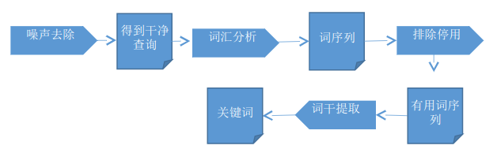
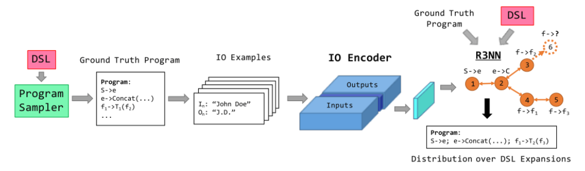
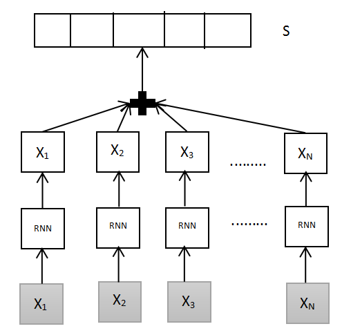

# SearchSystem & AutoPrograming 

    2017级操作系统大作业

---

# API_Case数据集：
  - 

---
# 搜索系统：
## 王楚然小组方案：**基于概率模型的关键词检索**

**组员:**
   王楚然，陈佳辉，成昱霖，杨志昊，肖昂弘，许卓佳，黄冰，钟振远，陈家兴，钟声亮，曹丽洁

**实施方案:**

  - **文本预处理：**
      - 1.噪声去除
      - 2.词汇分析
      - 3.排除停用词
      - 4.词干提取
      - 
  * **检索思路：**
      - 1用布尔向量表示搜索语句和库中的描述文本；
      - 2.计算词汇的概率初值，根据相似度计算公式计算每个文本向量和查询向量的相似度;
      - 3.按照文档向量和查询向量的相似度，排序输出初始排序结果集（即描述文本为键，case为值的键值对结果集）;
      - 4.在初始结果集，用户指定或按缺省约定选择相关文档，形成相关文档集合；
      - 5.根据初始概率的改进公式或其变形公式，计算初始概率分布或其变形公式，计算初始概率分布；
      - 6.重新计算各文档与查询的相似度，排序输出最终结果集（排序），根据键值导出case。
  * **检索思路2：**
      - 基于概率模型的关键词检索出候选API，通过case分析选出产生候选API的概率最大的case，成为候选case参与结果排序输出。

---

---
# 自动编程

## 王楚然小组方案： IO-Encoder + R3NN模型
**组员** ：王楚然，陈佳辉，成昱霖，杨志昊，肖昂弘，许卓佳，黄冰，钟振远，陈家兴，钟声亮，曹丽洁

**实施方案：**

利用我们的基本方案积累大量的用户需求描述与case集合（用户需求为输入，case为输出的数据对）。通过这些输入输出样本，训练R3NN模型用于自动编程。

需求描述（自然语言）与输出通过IO Encoder（利用LSTM网络）来得到IO对，区分出哪些输出可以通过输入计算得到，哪些特征能帮助识别出有用的API。将IO对输入到R3NN模型进行训练，得到自动编程模型。（见流程图）:

---

## 骆明楠小组方案： 语义网络 + 对抗神经网络
**组员：** 骆明楠，郑蓝翔，黎官钊，刘珍梅，杨煜，彭晶，朱清清

**实施方案：**

  - 流程如图：
  - 
  - **语义分析模型**:
    将需求描述语句转为相应特征向量。
  - **真实代码模块**： 
    传入真实的某case代码。
  - **G代码生成模型**：
    传入语义模型输入的特征，生成相应代码。
  - **D判别网络**：
      + 判断当前输入的代码是否为真实代码（G传来的是假代码，真实代码模块传入的是真实代码）。
      + 获取的输入为：G网络输出、真实代码、语义模型传来的特征。 
      + 附加判断信息： API标签信息

让G和D交替训练（或者让G多训练）到一定程度时，若D模型不能很好判断真假代码时候，说明G已经训练得不错了。

这时候就可以用让需求的描述信息 ，通过**语义分析模型+ G代码生成模型**,就可以生成我们想要的代码了。

---

## 邓梓君小组方案： Encoder-Decoder模型

**组员**: 邓梓君，李可可，于田菲，晏明昊，贺海，吴章勇

**实施方案：**

  - 1）基于深度学习，使用Encoder-Decoder的模型架构
      + Encoder：** Bi-LSTM，对自然语言进行编码**
      + Decoder：** LSTM，通过多步解码出结果**
  - 2）引入编译原理中的“Abstract Syntax Tree（AST）”概念，将原本“自然语言->程序代码”的      直接过程变为“自然语言->AST->程序代码”的两步过程
  - 3）借助编译器相关的工具，AST与程序代码之间可以无损、确定性地互相转换学习目标减小为“自然语言->AST”，编程语言的语法作为先验信息融入到模型中模型不需要额外去学习编程语言的特定语法，模型的参数搜索空间被缩减了，降低优化难度.

模型能专注于学习如何把自然语言抽象成AST得到AST，就能保证得到语法正确的代码

---

## 邓波小组方案： 代码模块化+解析器识别及构建

**组员:** 郑波、陈浪、张志杰、陈姣姣、陈莹

**实施方案：**

由“搭建网络就如搭积木”的Keras受到启发，对于一个特定的用户网络搭建需求，是否能自动生成相应的代码。为了实现这个目标，预计需要以下几个模块需要实现：

  - 1）用户搭建网络形式，以及最终生成的待识别文件模板由于简单网络（例如MLP和CNN）的结构特点，用户有多种方式进行网络的构建，比如拖拽控件，或者点击候选框设定网络层参数进行插入等。用户通过这种方式可以构建一个完整的网络结构，而我们的工程需要根据这些用户操作，自动生成后续识别模块容易理解的代码，例如包含网络结构完整信息的xml文件等。
  - 2）根据用户搭建网络时的生成文件，自动识别生成网络框架代码的识别模块Keras提供的两种网络模型的构建方法都很适合用来识别和搭建用户输入的一层层网络结构。关键在于解析器的实现，这是本工程的难点所在。

---

## 李洛勤小组方案：基于双注意力机制神经网络的句子相似度识别生成代码

**组员**：李洛勤，谢锦松，叶龙，李林杰，郭美圆，李继昌，王翔

**实施方案：**

参考的文献：《Neural Relation Extraction with Selective Attention over Instances 》(2016)

  - 1 利用神经网络进行训练（RNN，基于word-level的实现）
      + （1）把多个事例转化为自然语言，词向量作为输入
      + （2）Case的类别作为标签
      + （3）Attention-layer，把word合并和句子级别其神经网络图如下：
      + 

  - 2 基于句子级别（sentence-level）再用一次神经网络
      + （1）多事例（也即多个句子）合并
      + （2）RNN神经网络
      + （3）Attention-layer
      + 
  - 3当用户输入需求然后得到相应类别
  - 4.在该类别中，首先利用用户输入与该类别下的多事例做句子相似度匹配
  - 5.得到多事例排名，最后得到代码.

分工：

  - 1.收集case的描述和其类别。
  - 2.实现预处理（参考别人的代码：TensorFlow-NRE）
  - 3.神经网络实现算法（算法模型时：TensorFlow-NRE-master）
  - 4.关键词提取（词语相似度，跟TAG匹配，设阈值）
  - 5.实现句子相似度识别算法（找出一个句子和另外不同句子的相似度）
  - 6.前台页面的构建（有输入和输出）、UI设计
  - 7.说明文档（项目文档）
  - 8.时间安排

---
