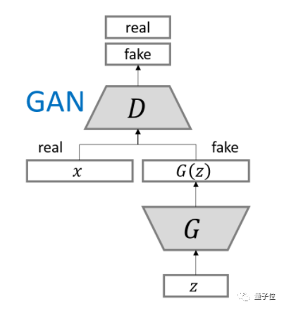
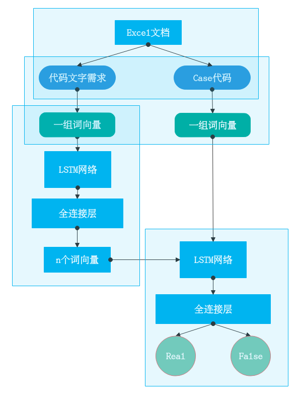
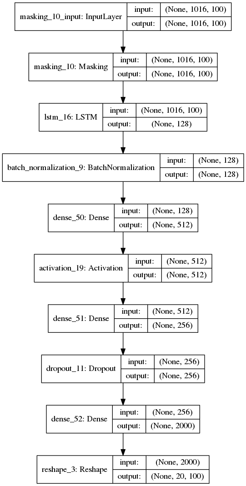
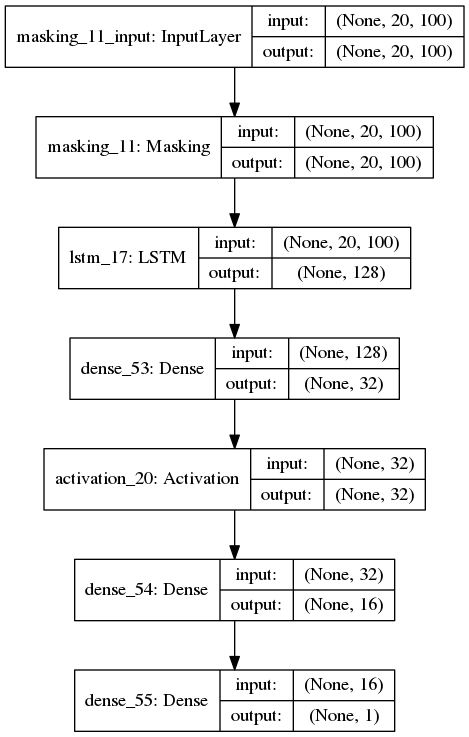
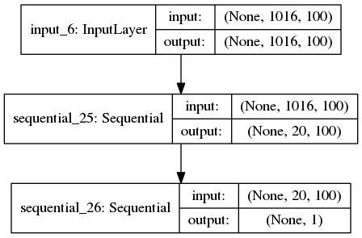

---

# 自动编程项目

#### 组员： 骆明楠, 黎官钊, 杨煜, 刘珍梅, 朱清清, 彭晶, 郑蓝翔

---

## 项目分析

||描述|
|--|--|
|项目目标|输入**代码需求**的文字，输出对应**c程序代码**|
|已有数据|代码文字需求、对应的case代码和API|
|采用方案|**神经网络生成代码**|

---

## 预备知识

##### 词向量：

使用向量来表达词，机器学习算法才能处理自然语言。通用做法是：

- one-hot，即用长度为词库大小的向量来表示某词，向量分量中只有该词的位置为1,其他位置均为0.缺点：
    + 容易受维数灾难的困扰
    + 不能很好地刻画词与词之间的相似性
- Distributed Representation，通过训练将某种语言中的每一个词映射成一个固定长度的短向量。优点：
    + 短
    + 引入了词间的距离，能很好表示词间相似度。
    + 方法代表：Word2Vec

---

##### LSTM神经网络：

LSTM（Long Short-Term Memory）是长短期记忆网络，是一种时间递归神经网络。

- 适合于处理和预测时间序列中间隔和延迟相对较长的重要事件。
- 它是当前最流行的RNN，在语音识别、图片描述、自然语言处理等许多领域中成功应用。
- 简单理解： 输入一组词向量，输出经过提炼的一组向量

---

##### 生成对抗网络：

- G(z)是一个神经网络，将训练成将样本z从先前的噪声分布P(z)映射到真实的数据空间。
- D(x)是一个神经网络，以数据样本x为输入，输出标量值。目的是判断x是真实数据还是G中的生成数据
- D目的是分辨出输入数据是真实样本还是生成样本。
- G的目的是混淆D，让D无法正确分辨。即生成的样本分布尽量和真实样本分布相似。
- 

---

## 方案设计

|模块|描述|技术点|
|--|--|--|
|数据预处理|将Excel文档内容提取成相应格式|文本预处理|
|语义分析模型|将需求文字或case代码转为相应词向量|Word2Vec|
|生成网络G|将需求词向量进行提取，生成对应的代码词向量|深度神经网络|
|判别网络D|判断传入的代码词向量是真实还是生成的|深度神经网络|

整体设计如图：

 

---

## 分工情况

|子项目|成员|
|------|----|
|数据预处理|朱清清，彭晶，黎官钊|
|语义分析设计及编码|骆明楠，郑蓝翔，杨煜，彭晶|
|GAN设计及编码|骆明楠，黎官钊，刘珍梅|

---

## 项目进展：

|模块|进度|备注|
|--|--|--|
|数据预处理|80%|只剩下case代码预处理不佳|
|语义分析模型|90%|基础代码已完成，尚未将case代码转为词向量| 
|GAN设计及编码|70%|代码编写已完成，尚未调试|

---

## 网络架构

####生成网络：

- 

---

####判别网络：

- 

---

####GAN网络（Combined）:

- 

---

 
 
# Q & A
 

---

